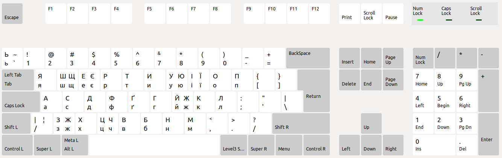

# Ukrainian Homophonic keyboard layout
This is an alternate Ukrainian homophonic keyboard layout that uses 3rd-level
keys to access additional Cyrillic characters.
This is unlike existing homophonic layouts that replace useful punctuation keys.

To install:
* Run install script: `./install.sh`
* In language settings, add the new keyboard: `Ukrainian (homophonic-AltGr)`

